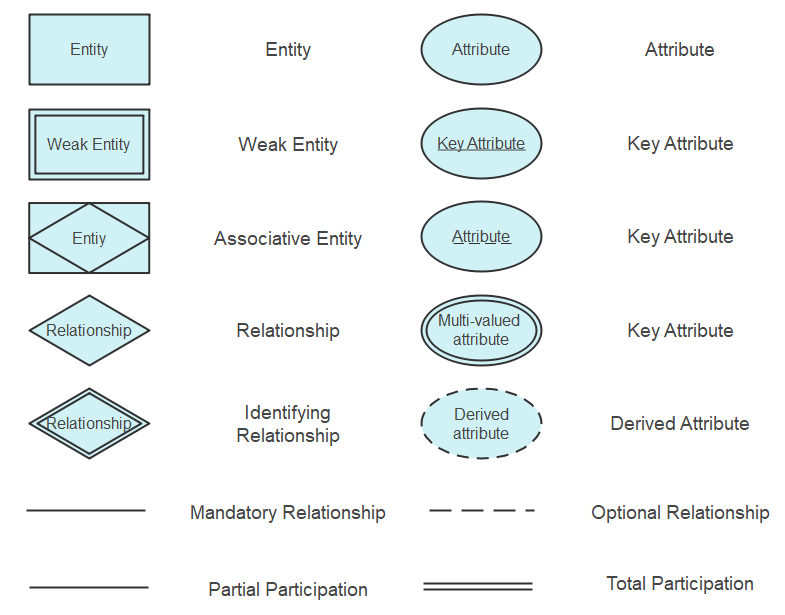
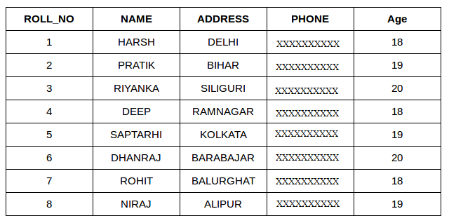
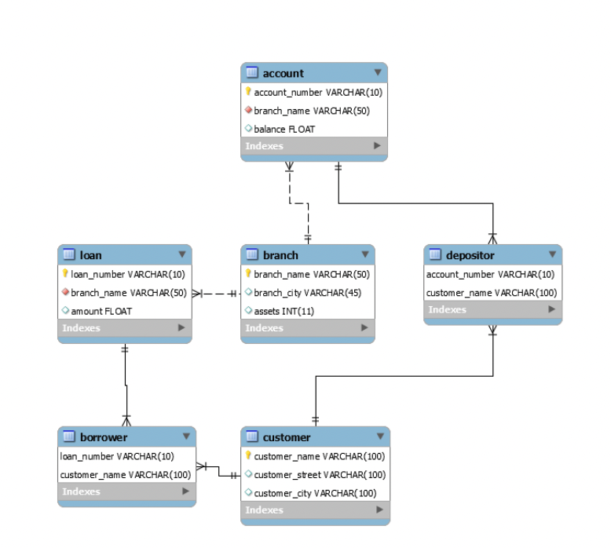
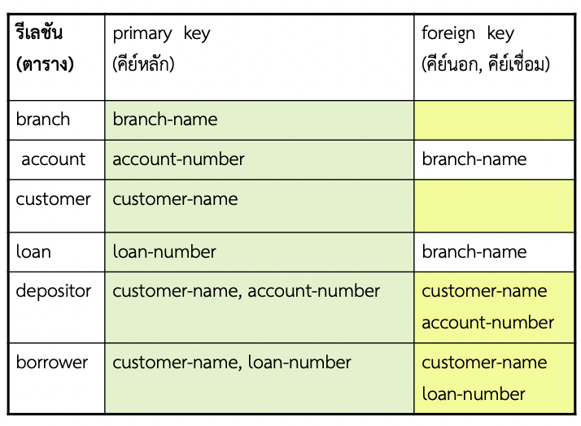

# DATABASE SYSTEMS
## Entity - Relationship Model (ER diagram)
### ER diagram

- รูปสี่เหลี่ยมผืนผ้า ( rectangles ) ใช้แสดงเซตของเอนทิท
- รูปสี่เหลี่ยมขนมเปียกปูน ( diamonds ) ใช้แสดงเซตของความสัมพันธ์
- รูปวงรี ( ellipse ) ใช้แสดงแอททริบิวต์โดยมีลักษณะ
- รูปวงรีเส้นคู่ แสดงแอททริบิวต์ชนิด multivalued attribute
- รูปวงรีเส้นประ แสดงแอททริบิวต์ ชนิด derived attribute
- รูปวงรีปกติ ( เส้นเดียว) แสดงแอททริบิวต์ทั่วๆไป
- ถ้ามีการขีดเส้นใต้ที่แอททริบิวต์ แสดงว่าแอททริบิวต์นั้นๆเป็นคีย์ ( Key )  

**เราสามารถพิจารณาฐานข้อมูลเป็น 2 แบบคือ**  
◦ กลุ่มของเอนทิที  
◦ ความสัมพันธ์ระหว่างเอนทิที  
- ความหมายของเอนทิที คือ “วัตถุหรือสิ่งของที่แยกออกจากิส่ิงอื่น อย่างชัดเจน” เช่น กลุ่มของบุคคล, บริษัท, เหตุการณ์, โรงงาน
- เอนทีที (entity) ประกอบด้วยลักษณะต่างๆ ซึ่งเรียกลักษณะว่า เป็นแอททริบิวต์ (attribute) เช่น ข้อมูลบุคคลประกอบด้วยชื่อและที่อยู่ โดยชื่อเป็น 1 แอททริบิวต์และที่อยู่เป็น 1 แอททริบิวต์  

**การอธิบาย Entity**   
Customer = ( customer-id, customer-name, customer-street, customer-city)  
หมายถึง ข้อมูล Customer ทุกตัวมีแอททริบิวต์ 4 ประการที่อยู่ในวงเล็บ
### Relationship Sets
Mapping cardinalities constraints ซึ่งระบุจำนวนของเอนทิทีที่สัมพันธ์กันว่าเป็นอย่างไรได้บ้าง  
เซตของความสัมพันธ์ไบนารี mapping cardinality มี 4 ชนิดดังนี้  
- ชนิด หนึ่ง ต่อ หนึ่ง (one to one relationship set)  
- ชนิด หนึ่ง ต่อ หลาย (one to many relationship set)  
- ชนิด หลาย ต่อ หนึ่ง (many to one relationship set)  
- ชนิด หลาย ต่อ หลาย (many to many relationship set)
### Key
 สิ่งที่สำคัญในการนำข้อมูลจากฐานข้อมูลมาใช้งาน  
◦ จะต้องมีค่าประจำข้อมูลแต่ละตัวที่ไม่ซ้ากับของข้อมูลอื่น ๆ เช่น รหัสนักศึกษา แต่ละคนไม่มีทางซ้ำกัน  
◦ ค่านี้มีประโยชน์ในการอ้างอิงข้อมูลแต่ละตัว เพื่อ เข้าถึงข้อมูลได้อย่างถูกต้องและรวดเร็ว แอททริบิวต์ที่เก็บค่านี้ เรียกว่า คีย์ (key attribute)  
1) candidate key (คีย์คู่แข่ง) คือ เป็น attribute ที่มีคุณสมบัติเป็น primary key ได้  
2) primary key (คีย์หลัก) คือ candidate key ที่นำมาใช้งานจริงในการออกแบบ เพราะ candidate key อาจจะมีหลายชุด เราจึงต้องกำหนดเพียงชุดเดียวในการทำงานหลัก
3) คีย์นอก(foreign key) คือคีย์ที่ใช้เชื่อมความสัมพันธ์ระว่างตาราง 2 ตารางเข้าด้วยกัน
## Relational data model
### Relataion
รีเลชัน คือ ตาราง ซึ่งประกอบด้วย คอลัมน์และแถว  
◦ คอลัมน์ คือ รายละเอียดของข้อมูล  
◦ แถว คือ ข้อมูลจริงที่ถูกเก็บ  

### Attribute

- แอททริบิวต์ จะต้องมีชื่อและในรีเลชันเดียวกันห้ามมีชื่อซ้ากันโดยค่าที่เป็นไปได้ทั้งหมดของแอททริบิวต์แต่ละตัวเราเรียกว่าโดเมนของแอททริบิวต์  
- ค่าของแอททริบิวต์ จะต้องมีค่าสมบูรณ์ภายในตัวเอง (atomic)  
- ค่า NULL (ค่าว่าง) เป็นสมาชิกในโดเมนทุกตัว นั่นคือ โดยปกติ แอททริบิวต์ทุกตัว สามารถเป็นค่า NULL ได้ 

### ER diagram to Schema Diagram
- ถ้าใน m:1 Relationship Key ของอีกตารางจะแทรก อยู่ในฝั่ง ตาราง m   
- ถ้าใน 1:1 Relationship Key ของอีกตารางจะแทรก อยู่ในฝั่งใดก็ได้
   

## The Enchanced Entity - Relationship Model (EER)
## Schema refinement and normal forms
## Database Index
## Relational Algebra Transacation and Triggers
## Database Management Systems