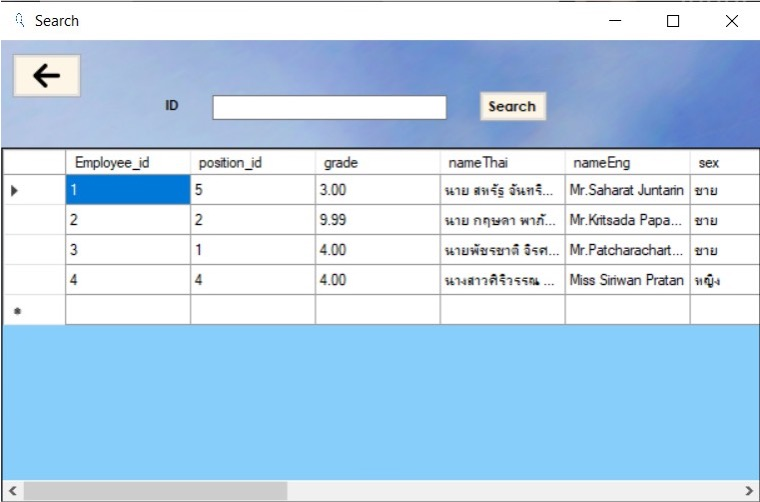

# DATABASE SYSTEMS
## Entity - Relationship Model (ER diagram)
### ER diagram

- รูปสี่เหลี่ยมผืนผ้า ( rectangles ) ใช้แสดงเซตของเอนทิตี้
- รูปสี่เหลี่ยมขนมเปียกปูน ( diamonds ) ใช้แสดงเซตของความสัมพันธ์
- รูปวงรี ( ellipse ) ใช้แสดงแอททริบิวต์โดยมีลักษณะ
- รูปวงรีเส้นคู่ แสดงแอททริบิวต์ชนิด multivalued attribute
- รูปวงรีเส้นประ แสดงแอททริบิวต์ ชนิด derived attribute
- รูปวงรีปกติ ( เส้นเดียว) แสดงแอททริบิวต์ทั่วๆไป
- ถ้ามีการขีดเส้นใต้ที่แอททริบิวต์ แสดงว่าแอททริบิวต์นั้นๆเป็นคีย์ ( Key )  

**เราสามารถพิจารณาฐานข้อมูลเป็น 2 แบบคือ**  
◦ กลุ่มของเอนทิที  
◦ ความสัมพันธ์ระหว่างเอนทิที  
- ความหมายของเอนทิที คือ “วัตถุหรือสิ่งของที่แยกออกจากิส่ิงอื่น อย่างชัดเจน” เช่น กลุ่มของบุคคล, บริษัท, เหตุการณ์, โรงงาน
- เอนทีที (entity) ประกอบด้วยลักษณะต่างๆ ซึ่งเรียกลักษณะว่า เป็นแอททริบิวต์ (attribute) เช่น ข้อมูลบุคคลประกอบด้วยชื่อและที่อยู่ โดยชื่อเป็น 1 แอททริบิวต์และที่อยู่เป็น 1 แอททริบิวต์  

**การอธิบาย Entity**   
Customer = ( customer-id, customer-name, customer-street, customer-city)  
หมายถึง ข้อมูล Customer ทุกตัวมีแอททริบิวต์ 4 ประการที่อยู่ในวงเล็บ
### Relationship Sets
Mapping cardinalities constraints ซึ่งระบุจำนวนของเอนทิทีที่สัมพันธ์กันว่าเป็นอย่างไรได้บ้าง  
เซตของความสัมพันธ์ไบนารี mapping cardinality มี 4 ชนิดดังนี้  
- ชนิด หนึ่ง ต่อ หนึ่ง (one to one relationship set)  
- ชนิด หนึ่ง ต่อ หลาย (one to many relationship set)  
- ชนิด หลาย ต่อ หนึ่ง (many to one relationship set)  
- ชนิด หลาย ต่อ หลาย (many to many relationship set)
### Key
 สิ่งที่สำคัญในการนำข้อมูลจากฐานข้อมูลมาใช้งาน  
◦ จะต้องมีค่าประจำข้อมูลแต่ละตัวที่ไม่ซ้ากับของข้อมูลอื่น ๆ เช่น รหัสนักศึกษา แต่ละคนไม่มีทางซ้ำกัน  
◦ ค่านี้มีประโยชน์ในการอ้างอิงข้อมูลแต่ละตัว เพื่อ เข้าถึงข้อมูลได้อย่างถูกต้องและรวดเร็ว แอททริบิวต์ที่เก็บค่านี้ เรียกว่า คีย์ (key attribute)  
1) candidate key (คีย์คู่แข่ง) คือ เป็น attribute ที่มีคุณสมบัติเป็น primary key ได้  
2) primary key (คีย์หลัก) คือ candidate key ที่นำมาใช้งานจริงในการออกแบบ เพราะ candidate key อาจจะมีหลายชุด เราจึงต้องกำหนดเพียงชุดเดียวในการทำงานหลัก
3) คีย์นอก(foreign key) คือคีย์ที่ใช้เชื่อมความสัมพันธ์ระว่างตาราง 2 ตารางเข้าด้วยกัน
## Relational data model
### Relataion
รีเลชัน คือ ตาราง ซึ่งประกอบด้วย คอลัมน์และแถว  
◦ คอลัมน์ คือ รายละเอียดของข้อมูล  
◦ แถว คือ ข้อมูลจริงที่ถูกเก็บ  

### Attribute

- แอททริบิวต์ จะต้องมีชื่อและในรีเลชันเดียวกันห้ามมีชื่อซ้ากันโดยค่าที่เป็นไปได้ทั้งหมดของแอททริบิวต์แต่ละตัวเราเรียกว่าโดเมนของแอททริบิวต์  
- ค่าของแอททริบิวต์ จะต้องมีค่าสมบูรณ์ภายในตัวเอง (atomic)  
- ค่า NULL (ค่าว่าง) เป็นสมาชิกในโดเมนทุกตัว นั่นคือ โดยปกติ แอททริบิวต์ทุกตัว สามารถเป็นค่า NULL ได้ 

### ER diagram to Schema Diagram
- ถ้าใน m:1 Relationship Key ของอีกตารางจะแทรก อยู่ในฝั่ง ตาราง m   
- ถ้าใน 1:1 Relationship Key ของอีกตารางจะแทรก อยู่ในฝั่งใดก็ได้  

## The Enchanced Entity - Relationship Model (EER)
### Degree of Relationship
- ความสัมพันธ์กับเอนติตี้ตนเอง (Unary Relationship หรือ Recursive Relationshipเป็นความสัมพันธ์ระหว่างเอนติตี้ภายในเอนติตี้เดียวกัน  

 
- ความสัมพันธ์ระหว่างสองเอนติตี้ (BinaryRelationship)  

- ความสัมพันธ์ระหว่างเอนติตี้มากกว่าสองเอนติตี้ (N-ary Relationship)  

  

แม้ว่าโมเดล ER ธรรมดา สามารถอธิบายข้อมูล และรูปแบบ ข้อมูลได้ชัดเจน แต่ยังไม่สามารถอธิบายความหมายบางอย่าง ซึ่ง จาเป็นจะต้องเพิ่มเติมกฎเกณฑ์บางอย่างลงไป ในโมเดล ER เพื่อให้ มีคุณสมบัติที่ดีขึ้นในการนำมาใช้ออกแบบฐานข้อมูล ซึ่งมีสิ่งที่ต้อง ศึกษาเพิ่มเติมคือ  
1. Specialization  
2. Generalization  
3. Attribute inheritance   
4. Aggregation  

### Subclass – specialization
หลักการของ specialization คือ เหมาะสำหรับการออกแบบจากบนลง ล่าง โดยการกำหนดกลุ่มย่อย ภายในเอนทิทีเซตที่กำลังสนใจ ซึ่งอาจจะ มีแอททริบิวต์ (รายละเอียด) บางอย่างที่แตกต่างออกไป 

### Superclass - generalization
ในการออกแบบ ลักษณะล่างขึ้นบน ( bottom-up) คือ การพิจารณา เอนทิทีเซตหลายตัว แล้วพยายามรวมกลุ่มขึ้นมา เพื่อให้อยู่ในระดับที่ สูงขึ้น โดยที่มีคุณสมบัติพื้นฐานบางอย่างร่วมกัน ลักษณะการพิจารณา เช่นนี้เรียกว่า generalization (หารูปแบบทั่วไป)  

## Schema refinement and normal forms
### Problems caused by redundancy
การออกแบบฐานข้อมูลที่ไม่ดี คือ ข้อมูลตัวเดียวกันอยู่ในหลายตาราง ลักษณะนี้เรียกว่า ความซ้ำซ้อนของข้อมูล (redundancy) ซึ่งท้าให้ เกิดปัญหาต่างๆ ดังนี้  
- เปลืองเนื้อที่ในการเก็บข้อมูล (Redundant storage)  
- ความผิดปกติที่เกิดจากการปรับปรุงข้อมูล (Update anomalies)  
- ความผิดพลาดที่เกิดจากการแก้ไขปรับปรุง ข้อมูล อัน ก่อให้เกิดความขัดแย้งของข้อมูลในรีเลชั่นที่สัมพันธ์กัน เช่น การแก้ไขข้อมูลของแถวใด ต้องตรวจสอบว่ามีการแก้ไขข้อมูล แถวอื่น ที่มีข้อมูลเดียวกันครบถ้วน
- ความผิดปกติที่เกิดจากการเพิ่มข้อมูล (Insertion anomalies) คือความผิดพลาดที่เกิดจากการเพิ่มข้อมูล เช่น การเพิ่ม ข้อมูลที่เป็นคีย์หลักด้วยค่าว่างหรือซ้ำกับข้อมูลเดิม (มีผล ต่อ The Entity Integrity Rule)  
- ความผิดปกติที่เกิดจากการลบข้อมูล (Deletion anomalies)  
- ความผิดพลาดที่เกิดจากการลบข้อมูล เช่น ข้อมูลที่ถูก ลบ ถูกอ้างอิงจากรีเลชั่นอื่น
### Schema refinement
ในการออกแบบฐานข้อมูล ค้าถามที่มักจะเกิดขึ้น คือ
1. จากโมเดล ER เราจ้าเป็นจะต้องท้ารีเลชันให้น้อยลงอีกหรือไม่
2. จากโมเดล ER เราสามารถออกแบบความสัมพันธ์ให้เหมาะสม แล้วนำมาแปลงเป็นโมเดลเชิงสัมพันธ์ได้โดยตรงหรือไม่ (โดยไม่ ต้องท้าให้ย่อยลงมาอีก)
- คำตอบคือ การออกแบบฐานข้อมูลด้วยโมเดล ER ในบางครั้งสคีมาที่ ได้อาจจมีความซับซ้อนเกินไป เพราะ เงื่อนไขความถูกต้องของ ข้อมูล (IC)บางอย่าง ไม่สามารถก้าหนดในรูปแบบของโมเดล ER
### The process of normalization
- รูปแบบบรรทัดฐาน (normalization)  
◦ มาตรฐานที่ใช้ในการวิเคราะห์ความสัมพันธ์ของฐานข้อมูลโดย รูปแบบนี้มีหลายระดับกระบวนการที่ท้าให้เป็นรูปแบบบรรทัด ฐาน จะเป็นกระบวนการที่มีขั้นตอนชัดเจน
- จุดประสงค์หลักคือ  
◦ ท้าให้ฐานข้อมูลสามารถนำไปใช้งานได้อย่างมีประสิทธิภาพ โดย ไม่เกิดปัญหาความซ้ำซ้อนของข้อมูล
### Dependency Rule
เป็นกฎที่กล่าวถึง ความสัมพันธ์ระหว่างค่าของแอทริบิวต์ในแต่ละรี เลชั่น โดยมีรูปแบบความสัมพันธ์ 5 รูปแบบ คือ
1. Functional Dependency เป็นความสัมพันธ์ระหว่างค่าของ แอททริบิวต์แบบฟังก์ชั่น
2. Partial Dependency เป็นความสัมพันธ์ระหว่างค่าของแอททริ บิวต์แบบบางส่วน
3. Transitive Dependency เป็นความสัมพันธ์ระหว่างค่าของแอ ททริบิวต์แบบ ทรานซิทีฟ ที่ Nonkey Attribute สามารถระบุค่า Attribute อื่นได้
4. Multivalued Dependency เป็นความสัมพันธ์ระหว่างค่าของ แอททริบิวต์แบบหลายค่า
5. Join Dependency คือการเชื่อมโยงแอททริบิวต์ที่เหมือนกัน (เป็นคีย) ระหว่างรีเลชั่นที่แตกออกไป
## Database Index
## Relational Algebra Transacation and Triggers
## Database Management Systems

## Project
**ระบบการเก็บข้อมูลของพนักงานภายในธนาคาร**
### Background and Significance
เนื่องจากเราได้เล็งเห็นปัญหาการเก็บเอกสารข้อมูลต่างๆ ของพนักงานในรูปแบบเก่าโดยใช้กระดาษ ซึ่งมีความยุ่งยากในการหาข้อมูล เราจึงได้จัดทำระบบการจัดเก็บข้อมูลของพนักงานขึ้นมา โดยระบบที่รวบรวมข้อมูลต่าง ๆ ที่เกี่ยวข้องกันเข้าไว้ด้วยกันอย่างมีระบบมีความสัมพันธ์ระหว่างข้อมูลต่าง ๆ ที่ชัดเจน ในระบบฐานข้อมูลจะประกอบด้วยแฟ้มข้อมูลหลายแฟ้มที่มีข้อมูล เกี่ยวข้องสัมพันธ์กันเข้าไว้ด้วยกันอย่างเป็นระบบและเปิดโอกาสให้ผู้ใช้สามารถใช้งานและดูแลรักษาป้องกันข้อมูลเหล่านี้ได้อย่างมีประสิทธิภาพ โดยมีซอฟต์แวร์ที่เปรียบเสมือนสื่อกลางระหว่างผู้ใช้และโปรแกรมต่าง ๆ ที่เกี่ยวข้องกับการใช้ฐานข้อมูล เรียกว่า ระบบจัดการฐานข้อมูล หรือ DBMS (data base management system)มีหน้าที่ช่วยให้ผู้ใช้เข้าถึงข้อมูลได้ง่ายสะดวกและมีประสิทธิภาพ การเข้าถึงข้อมูลของผู้ใช้อาจเป็นการสร้างฐานข้อมูล การแก้ไขฐาน
### Objectives
1. เพื่อจัดการข้อมูลจำนวนมากให้เป็นระเบียบมากขึ้น
2. สามารถใช้ข้อมูลร่วมกันได้
3. หลีกเลี่ยงความขัดแย้งของข้อมูลได้
4. สามารถกำหนดระบบความปลอดภัยของข้อมูลได้
5. เกิดความเป็นอิสระของข้อมูล
### ER Diagram

### Schema Diagram

### Demo
- login   
    
- home

- search

- insert

- edit

- personal leave

### Souce Code
[click here](https://github.com/fonthap/523211-database-project)